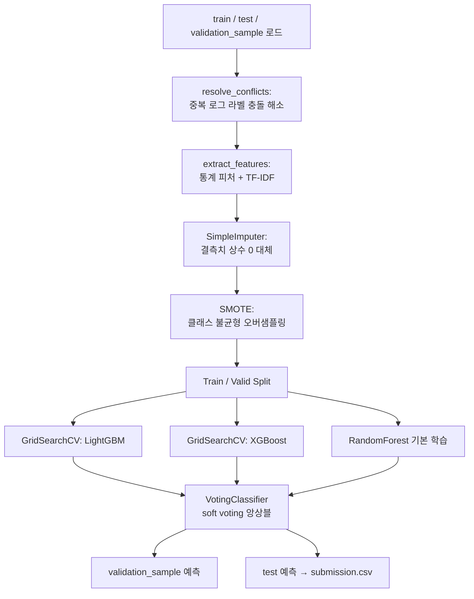

# 로그 심각도(Level) 분류 프로젝트 정리

> 1인 프로젝트 회고 문서 — `final_submission_code.py` 코드 분석을 근거로 작성. 배경 정보(과목/대회명 등)가 코드에 명시되지 않은 부분은 "(추정)"으로 표시함.

---

## 1. 담당 업무

1인 프로젝트로 아래 전 과정을 단독으로 수행함.

- 데이터 전처리: 동일 로그 텍스트에 라벨이 다르게 부여된 **충돌 데이터 해소**
- 피처 엔지니어링: 로그 텍스트 기반 통계 피처 + TF-IDF 벡터화
- 클래스 불균형 처리: SMOTE 오버샘플링
- 모델링: RandomForest / LightGBM / XGBoost 튜닝 및 Soft Voting 앙상블 구성
- 검증 및 제출 파이프라인 구축 (`validation_sample.csv` 예측 → `submission.csv` 생성)

---

## 2. 배운점, 주요 성과, 성장한 점, 한계점 및 발전 방향

**배운점**
- 텍스트 로그를 정형 피처(TF-IDF + 길이/자릿수/특수문자 통계)로 변환하는 방법
- 동일 입력에 라벨이 충돌할 때 다수결(동률 시 최소값 채택)로 정제하는 로직
- `SMOTE`를 이용한 다중클래스 불균형 처리, 그중에서도 `k_neighbors` 조정의 필요성
- `GridSearchCV`를 통한 모델별 하이퍼파라미터 튜닝
- `VotingClassifier(voting='soft')`로 서로 다른 계열의 모델(트리 기반 3종)을 앙상블하는 방법

**주요 성과**
- Public 0.8138 / Private 0.8206 (코드 상단 주석 기준) — Private 점수가 Public보다 높게 나와, 특정 리더보드에 과적합되지 않고 비교적 잘 일반화된 모델을 만듦.

**성장한 점**
- 이전 버전(`Additional_Generation_7level_using_noise.py`)은 `StandardScaler`, 다중공선성 제거, 모델별 세분화된 GridSearch, Validation Accuracy/F1 출력까지 포함한 더 복잡한 파이프라인이었음. 최종 제출본에서는 스케일링과 피처 제거 단계를 걷어내고 구조를 단순화함 — 여러 시도 끝에 불필요한 단계를 판별하고 정리하는 능력이 늘었음을 보여줌.

**한계점**
- RandomForest는 GridSearch 없이 기본 파라미터로만 사용됨(LightGBM/XGBoost만 튜닝).
- GridSearch 탐색 폭이 좁음(각 파라미터당 2개 값 수준).
- 최종 코드에는 검증 정확도/F1 등 정량 지표 출력이 없어, 제출 전 성능을 코드만으로는 확인할 수 없음.
- TF-IDF `max_features=100`으로 제한되어 있어 텍스트 정보 손실 가능성 있음.
- `SMOTE(k_neighbors=1)`은 극소수 클래스에 대한 임시방편적 대응으로, 합성 샘플의 품질이 낮을 수 있음.

**발전 방향**
- 교차검증 기반 성능 로그(Accuracy/F1 등) 재도입
- 하이퍼파라미터 탐색 범위 확대(RandomizedSearch/Optuna 등)
- TF-IDF 대신 로그 특화 임베딩 또는 사전학습 언어모델 활용 검토
- SHAP 등 모델 해석 기법 도입으로 예측 근거 확인

---

## 3. 요구사항 정의

**입력 데이터**
| 파일 | 주요 컬럼 | 용도 |
|---|---|---|
| `train.csv` | `id`, `full_log`, `level` | 모델 학습 |
| `test.csv` | `id`, `full_log` | 최종 제출 대상 |
| `validation_sample.csv` | `id`, `full_log` (`level` 포함 가능) | 제출 전 검증 |

**기능 요구사항**
- 동일 `full_log`에 서로 다른 `level`이 부여된 충돌 데이터를 하나의 라벨로 정제할 것
- 원본 로그 텍스트를 모델이 학습 가능한 수치 피처로 변환할 것
- 클래스 불균형을 완화할 것
- 여러 모델을 튜닝·앙상블하여 예측 성능을 높일 것
- `test.csv`에 대한 예측 결과를 `submission.csv`(`id`, `level`) 형식으로 출력할 것

**비기능 요구사항**
- 재현성: 전 과정에서 `random_state=42` 고정
- 처리 속도: `GridSearchCV(n_jobs=-1)`로 병렬 처리

---

## 4. 시스템 아키텍처 및 프로세스 흐름



전체 흐름은 하나의 스크립트(`final_submission_code.py`)에서 순차 실행되며, 별도의 서버/DB 없이 로컬 배치 처리 방식으로 동작함.

---

## 5. DB 설계 또는 Data Flow

별도 데이터베이스는 사용하지 않고 CSV 파일 기반으로 동작함. 데이터는 아래와 같이 단계적으로 변환됨.

**원본 컬럼**
| 컬럼 | 설명 |
|---|---|
| `id` | 로그 식별자 |
| `full_log` | 원본 로그 텍스트 |
| `level` | 로그 심각도 라벨 (train/validation) |

**피처 엔지니어링 후 추가되는 컬럼**
| 컬럼 | 설명 |
|---|---|
| `log_length` | 로그 문자열 길이 |
| `word_count` | 공백 기준 단어 수 |
| `digit_count` | 숫자 문자 개수 |
| `special_char_count` | 특수문자 개수 |
| `tfidf_0` ~ `tfidf_99` | TF-IDF 벡터(최대 100차원, 1~2gram) |

**변환 흐름**: `full_log`(원본 텍스트) → 통계 피처 + TF-IDF 벡터 결합 테이블 → 결측치 대체 및 컬럼 정렬(`reindex`) → 모델 입력 행렬 `X` → 예측 결과 `level` → `submission.csv`.

---

## 6. 담당 기능 개발 (대표 코드)

**① 중복 로그 라벨 충돌 해소** — 동일한 `full_log`에 서로 다른 `level`이 매겨진 경우, 다수결로 라벨을 정하고 동률이면 더 작은 레벨 값을 채택함.

```python
def resolve_conflicts(data):
    pivot = data.pivot_table(index='full_log', columns='level', aggfunc='size', fill_value=0)
    pivot['count'] = (pivot > 0).sum(axis=1)
    conflicting_logs = pivot[pivot['count'] > 1].reset_index()

    def resolve(row):
        levels = data[data['full_log'] == row['full_log']]['level']
        counts = levels.value_counts()
        if len(counts) > 1 and counts.iloc[0] == counts.iloc[1]:
            return counts.index.min()
        return counts.idxmax()

    conflicting_logs['resolved_level'] = conflicting_logs.apply(resolve, axis=1)
    resolved_data = data[~data['full_log'].isin(conflicting_logs['full_log'])]
    resolved_logs = conflicting_logs[['full_log', 'resolved_level']].rename(columns={'resolved_level': 'level'})
    return pd.concat([resolved_data, resolved_logs], ignore_index=True)
```

**② 피처 추출(TF-IDF + 통계 피처)** — train에서 학습한 `TfidfVectorizer`를 test/validation에는 재사용(`transform`)하여 피처 공간을 일치시킴.

```python
def extract_features(data, tfidf=None):
    data['log_length'] = data['full_log'].apply(len)
    data['word_count'] = data['full_log'].apply(lambda x: len(x.split()))
    data['digit_count'] = data['full_log'].apply(lambda x: sum(c.isdigit() for c in x))
    data['special_char_count'] = data['full_log'].apply(lambda x: sum(c in "!@#$%^&*()_+-=~`[]{}|;:',.<>?/" for c in x))

    if tfidf is None:
        tfidf = TfidfVectorizer(max_features=100, ngram_range=(1, 2))
        tfidf_matrix = tfidf.fit_transform(data['full_log'])
    else:
        tfidf_matrix = tfidf.transform(data['full_log'])

    tfidf_features = pd.DataFrame(tfidf_matrix.toarray(), columns=[f'tfidf_{i}' for i in range(tfidf_matrix.shape[1])])
    data = pd.concat([data.reset_index(drop=True), tfidf_features.reset_index(drop=True)], axis=1)
    return data, tfidf
```

**③ 앙상블 구성** — 튜닝된 LightGBM/XGBoost와 기본 RandomForest를 soft voting으로 결합.

```python
ensemble_model = VotingClassifier(estimators=[
    ('random_forest', rf_model),
    ('lightgbm', lgb_model),
    ('xgboost', xgb_model)
], voting='soft')

ensemble_model.fit(X_train, y_train)
```

---

## 7. 형상관리

Git 등 버전관리 시스템은 사용하지 않음. 대신 스크립트 사본을 남기는 방식으로 버전을 구분한 것으로 보임.

- `final_submission_code.py` / `final_submission_code-1.py`: 내용이 동일한 최종 제출 버전(사본)
- `Additional_Generation_7level_using_noise.py`: 스케일링·다중공선성 제거·세분화된 튜닝을 포함한 이전(탐색) 버전

**향후 개선 제안**: Git 저장소 도입, 커밋 단위로 실험 버전 관리, `.gitignore`로 데이터 파일 제외, README에 실험별 점수 기록.

---

## 8. 제출 자료 형식

과제 제출 시에는 PPT가 아닌 **한글(HWP) 문서**로 작성해 제출함. 본 정리 문서는 그 이후 회고 목적으로 **Notion 기록용 Markdown**으로 별도 작성한 것임.

---

## 9. 개발 중 이슈

- **극소수 클래스로 인한 SMOTE 오류**: `SMOTE(k_neighbors=1)`로 설정된 것으로 보아, 기본값(`k_neighbors=5`)으로는 특정 클래스의 샘플 수 부족으로 오류가 발생했을 것으로 추정. `k_neighbors`를 최소값으로 낮춰 우회함.
- **XGBoost 라벨 인코더 경고**: `use_label_encoder=False`, `eval_metric='mlogloss'`를 명시적으로 지정 — 구버전 XGBoost의 기본 라벨 인코더 관련 경고/에러를 회피하기 위한 조치로 추정.
- **train/test/validation 간 컬럼 불일치**: TF-IDF·통계 피처를 각 데이터셋에 독립적으로 적용하는 과정에서 컬럼 순서·개수가 어긋나는 문제가 있었던 것으로 보이며, `reindex(columns=X_train.columns, fill_value=0)`로 학습 시점의 컬럼 기준에 맞춰 정렬해 해결함.
- **중복 로그의 라벨 불일치**: 동일한 `full_log` 텍스트에 서로 다른 `level`이 부여된 데이터가 존재해, 학습 전 별도의 충돌 해소 로직(`resolve_conflicts`)이 필요했음.
- **파이프라인 단순화**: 초기 버전에서 시도했던 스케일링, 다중공선성 제거, 세분화된 튜닝이 최종본에서는 제거됨 — 성능 개선이 크지 않았거나 처리 시간 부담으로 인해 정리된 것으로 추정.
